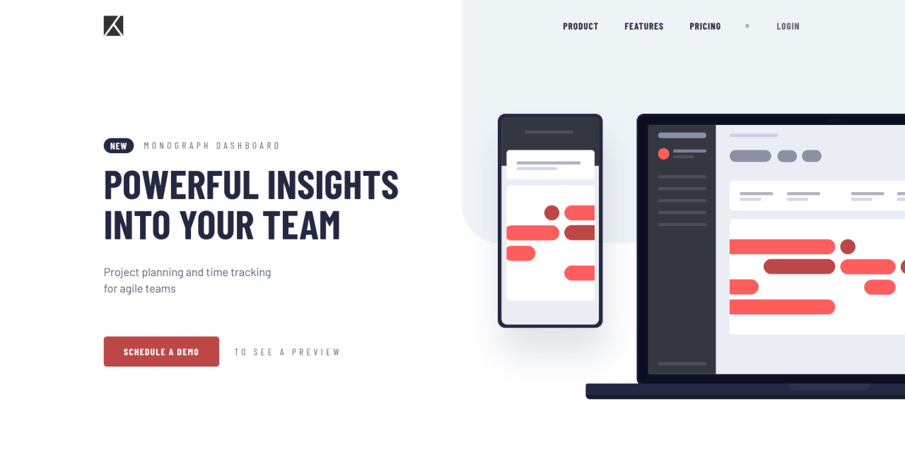
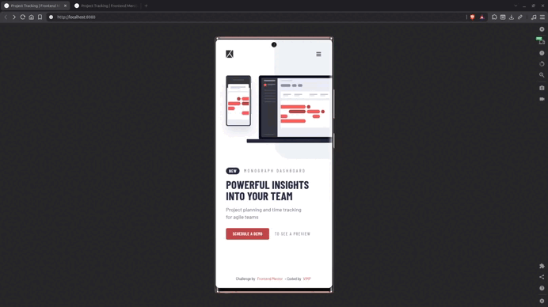

# Project Tracking Intro Component




> **Development Focus:** Semantic HTML · Accessibility · Scalable CSS Architecture · Mobile-First Development

Landing page built with semantic HTML, modern CSS architecture using Cascade Layers and design tokens, and accessible JavaScript interactions.

---

## Links

- [**Live Preview**](https://vimpdev.github.io/fem-js-junior-02-project-tracking-intro-component/)
<!-- - [**Frontend Mentor Solution**]() -->

---

## Demo



---

## Screenshots

| Mobile | Desktop |
| --- | --- |
|  |  |

--- 

## Features

- Responsive mobile-first layout
- Accessible navigation with keyboard support
- Reusable CSS architecture built with Cascade Layers
- Design tokens and utility classes for scalable styling

---

## Tech Stack

- **HTML**
  - Semantic elements
  - WAI-ARIA attributes

- **CSS**
  - Cascade Layers
  - Native CSS Nesting
  - Design Tokens (Custom Properties)
  - Logical Properties
  - Flexbox
  - Grid
  - Mobile-first workflow

- **JavaScript**
  - DOM manipulation
  - Event handling
  - State-driven UI
  - Progressive enhancement

- **Tooling**
  - pnpm
  - Servor
  - Git
  - GitHub

---

## Project Goals

- Recreate the provided Figma design with a responsive layout.
- Build reusable UI patterns using native CSS features.
- Apply accessible navigation patterns with modern browser APIs.
- Practice writing maintainable, component-oriented code.

---

## What I Learned

- Managing UI through a single state function keeps behavior predictable and avoids duplicated logic.
- Cascade Layers provide a clean separation between base styles, layout, components, and utilities.
- Modern browser APIs such as `inert` simplify accessibility without requiring additional JavaScript.

---

## JavaScript Highlights

- **`inert`** — Removes the navigation from both focus order and user interaction while the mobile menu is collapsed.

- **`toggleAttribute()`** — Declaratively adds or removes boolean attributes, avoiding manual attribute management.

- **`classList.toggle(name, force)`** — Explicitly synchronizes CSS classes with application state.
  ```js
  element.classList.toggle('is-expanded', isExpanded);
  ```

- **`Element.contains()`** — Detects whether a click occurred inside the navigation or toggle button, enabling click-outside behavior.

- **State-driven UI** —  A single function synchronizes ARIA attributes, CSS classes, and interaction states, making the interface easier to maintain.

---

## AI Collaboration
AI was used as a development assistant for architecture discussions, accessibility reviews, code review, and concept clarification.

All implementation, technical decisions, and final code were completed and validated manually.

---

## Author

- Frontend Mentor – [@vimpdev](https://www.frontendmentor.io/profile/vimpdev)

---

## Challenge Source

Build as a solution to the [Project tracking intro component challenge on Frontend Mentor](https://www.frontendmentor.io/challenges/project-tracking-intro-component-5d289097500fcb331a67d80e).